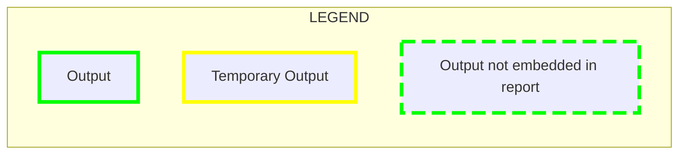
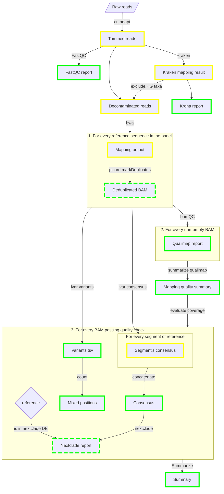

#

## Legend

```mermaid
flowchart LR;
  subgraph LEG[LEGEND];
  L1[Output];
  L2[Temporary Output];
  L3[Output not embedded in report];

  style L1 stroke:#00ff00,stroke-width:4px;
  style L3 stroke:#00ff00,stroke-width:4px, stroke-dasharray: 15 7;
  style L2 stroke:#ffff00,stroke-width:4px;
  end;
```

## Diagram

```mermaid
flowchart TB;
  classDef OUTPUT stroke:#00ff00,stroke-width:4px;
  classDef TEMP stroke:#ffff00,stroke-width:4px;
  classDef NOREPORT stroke:#00ff00,stroke-width:4px, stroke-dasharray: 15 7;

  A[/Raw reads/];
  B[Trimmed reads]:::TEMP;
  F[Decontaminated reads]:::TEMP;
  C[Kraken mapping result]:::TEMP;
  E[Krona report]:::OUTPUT;
  D[FastQC report]:::OUTPUT;
  Z[Summary]:::OUTPUT;
  H[Mapping quality summary]:::OUTPUT;

  A-->|cutadapt|B;
  B-->|kraken|C;
  C-->E;
  B-->F;
  C-->|exclude HG taxa|F;
  F-->|bwa|S1;
  B-->|FastQC|D;

  S1-->|bamQC|S2;
  S2-->|summarize qualimap|H;
  H--->|evaluate coverage|S3;
  S1-->|ivar consensus|S3_S1;
  S1-->|ivar variants|S3_1;
  S3---->|Summarize|Z;

  subgraph S1[1. For every reference sequence in the panel];
  direction TB;
    S1_0[Mapping output]:::TEMP;
    S1_1[Deduplicated BAM]:::NOREPORT;
    S1_0-->|picard markDuplicates|S1_1;
  end;

  subgraph S2[2. For every non-empty BAM]
  direction TB;
    S2_0[Qualimap report]:::OUTPUT;
  end;

  subgraph S3[3. For every BAM passing quality check]
  direction TB;
    S3_D{reference};
    S3_0[Consensus]:::OUTPUT;
    S3_1[Variants tsv]:::OUTPUT;
    S3_2[Mixed positions]:::OUTPUT;
    S3_3[Nextclade report]:::NOREPORT;
    S3_S1-->|concatenate|S3_0;
    S3_1-->|count|S3_2;
    S3_D-->|is in nextclade DB|S3_3;
    S3_0-->|nextclade|S3_3;
  end;

  subgraph S3_S1[For every segment of reference];
  direction TB;
    S3_S1_0[Segment's consensus]:::TEMP;
  end;
```
